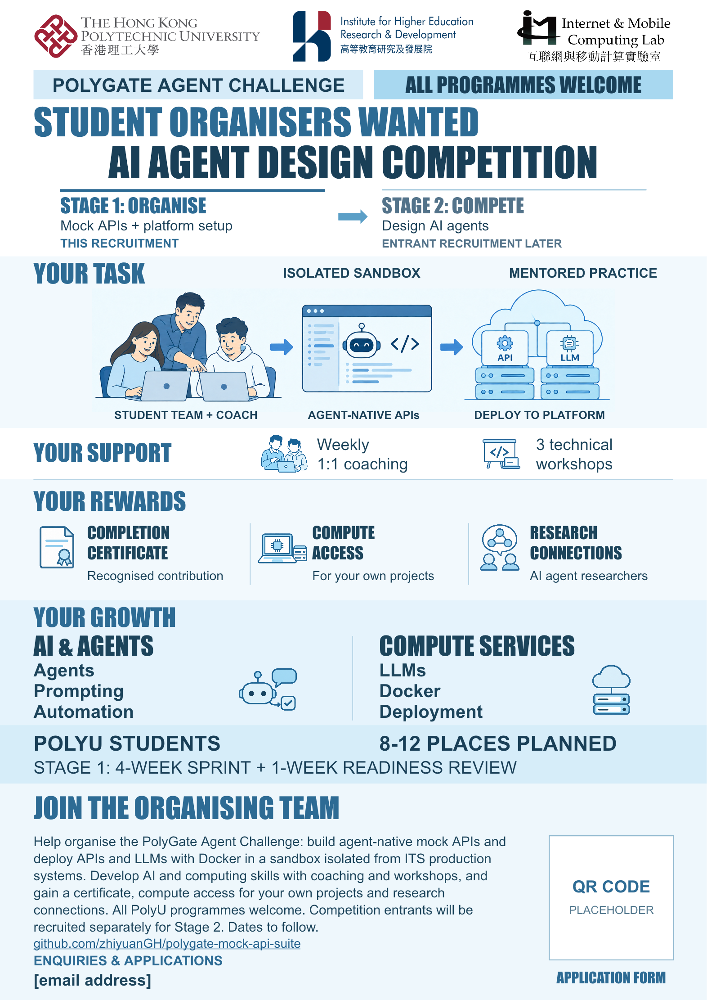

# Student Organiser Recruitment Poster

English A3 portrait poster for the PolyGate Agent Challenge. This version recruits the organising team for an AI agent design competition, with all PolyU programmes welcome.

## Current Draft

- [Editable PowerPoint](editable/PolyGate_Student_Organisers_EN_ContactPlaceholders.pptx?raw=true)
- [Full-size PNG preview](editable/PolyGate_Student_Organisers_EN_ContactPlaceholders.png)
- [Illustration assets and logo sources](ASSETS.md)

**Contact details are placeholders.** The square labelled QR CODE / PLACEHOLDER is not scannable. The email field reads `[email address]` under ENQUIRIES & APPLICATIONS. Replace both before distributing the poster. Application dates remain to be confirmed.

## Contents

The poster distinguishes Stage 1, organising the mock environment and competition, from Stage 2, when entrants design AI agents and compete. Its body follows YOUR TASK, YOUR SUPPORT, YOUR REWARDS and YOUR GROWTH.

Student organisers develop agent-native mock APIs and deploy API and LLM services in a sandbox isolated from ITS production systems. Support includes weekly 1:1 coaching and three technical workshops. Rewards include a completion certificate, compute access for students' own projects and connections with AI agent researchers. There is no cash stipend. Planned places: 8-12. The Stage 1 schedule is a four-week sprint and one-week readiness review.

## Editing

The PowerPoint is the editable source. Text, the two-stage overview, backgrounds, dividers and contact placeholders are native PowerPoint objects. Illustrations and institution logos are separate movable images. The API and LLM labels within the workflow artwork are part of that image, while the original LLM icon is separate. The poster uses Impact and Arial and has an A3 portrait page size.

Only the current draft and its supporting assets are included here. Superseded designs and temporary rendering files are not part of this publication.
